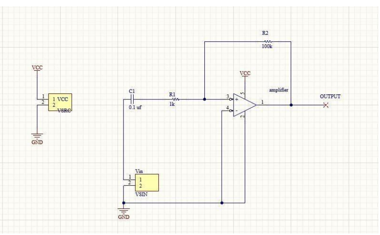
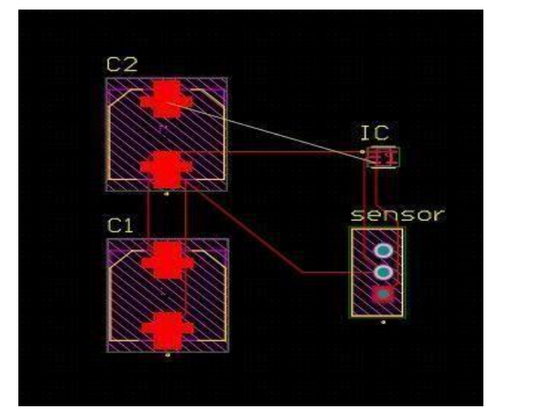
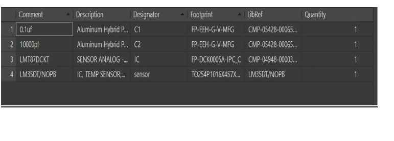

# Analog-Temperature-Sensor-with-LCD-Interface-using-altium

## 🎯 Objective
Design and develop a reliable and optimized PCB based on a reference circuit, ensuring proper schematic design, routing, and manufacturability.

---

## 📘 Introduction
This project focuses on creating a professional PCB starting from a reference schematic to a fully routed and 3D-verified board. The design follows EDA rules, proper grounding, trace width calculations, and optimized component placement.

---

## 📡 Reference Circuit

---

## 🛠️ Designed Circuit (Schematic)

---

## 🧵 Routing Details

---

## 🧊 3D PCB View

---

## 📦 Bill of Materials (BOM)

---

## ✅ Conclusion
This PCB project successfully converts a reference schematic into a well-designed, manufacturable PCB. All stages—schematic creation, routing, 3D validation, and BOM generation—ensure the final board is reliable and production-ready.  

---
